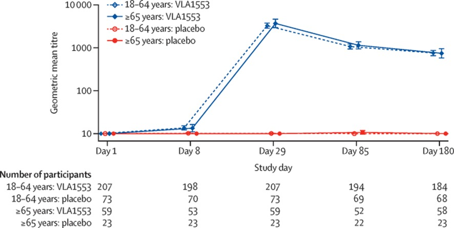

\thispagestyle{empty}

\begin{center}
  \vspace*{1cm}

  \Huge
  \textbf{TP 1: Validación de datos}

  \vspace{0.5cm}
  \LARGE

  \vspace{1.5cm}

  \textbf{Alumnos:}  Malena Irisarri, Román Landa\\

  \vfill

  \includegraphics[width=0.9\textwidth]{tp1/img/logo_universidad}

  \vspace{0.8cm}


  Rosario, Argentina

  6 de Mayo de 2025
\end{center}

\newpage


# Autor principal y afiliación

El artículo titulado “Safety and immunogenicity of a single-shot live-attenuated chikungunya vaccine: a double-blind, multicentre, randomised, placebo-controlled, phase 3 trial” fue escrito por la compañía de biotecnología Valneva Austria, ubicada en Vienna, Austria, en colaboración con el instituto de investigaciones Assign Data Management and Biostatistics, Innsbruck, Austria.


# Revista y referencia bibliográfica

El artículo fue publicado en la revista The Lancet en el año 2023 (DOI: 10.1016/S0140-6736(23)00641-4)

# Información metodológica

## Tipo de estudio

El estudio fue diseñado como un ensayo clínico aleatorizado, controlado con placebo y de grupos paralelos. Esto significa que los participantes fueron asignados al azar a dos grupos,  algunos recibieron la vacuna experimental (VLA1553) y otros un placebo. Luego se los siguió a lo largo del tiempo para comparar estos dos grupos independientes.

## Fase del estudio

Se trata de un ensayo en fase 3, es decir, un ensayo con el objetivo principal de evaluar la seguridad y la inmunogenicidad de la vacuna en una población más amplia, después de haber superado las fases previas de desarrollo clínico.

## Hipótesis estadística

La hipótesis principal del estudio se basó en la superioridad de la vacuna en términos de inmunogenicidad, no en equivalencia. El criterio principal fue la proporción de participantes que alcanzaron niveles seroprotectores de anticuerpos (definidos como μPRNT50 mayor o igual a 150) a los 28 días después de la vacunación.

## Enmascaramiento

El estudio se realizó bajo un esquema de doble ciego, ni los participantes ni los investigadores que realizaban las evaluaciones sabían quién recibió la vacuna y quién recibió el placebo.
Unidad de aleatorización
La aleatorización se realizó a nivel individual en una proporción 3 a 1, es decir, tres participantes recibieron la vacuna por cada uno que recibió placebo.
La aleatorización se realizó mediante un sistema de respuesta interactiva o sistema interactivo web (IXRS). Cada participante recibió un número de selección único a través del IXRS en la visita de selección, y fue asignado al tratamiento en la visita 1 (día 1). El personal del estudio no enmascarado preparó la vacuna de acuerdo a la información de IXRS, y las jeringas se enmascararon para ocultar el contenido antes de la administración.

## Población

Los participantes elegibles eran voluntarios sanos de 18 años o más. Se excluyeron aquellos con antecedentes de infección por virus de chikungunya, artritis o artralgia inmunomediada o crónica, defectos conocidos o sospechados del sistema inmunológico. Los participantes fueron estratificados por edad (estrato A: 18–64 años; estrato B: 65 años o más). 
Entre los criterios de exclusión se encontraban haber recibido una vacuna inactivada dentro de las 2 semanas anteriores o una vacuna viva dentro de las 4 semanas previas a la vacunación con VLA1553. 
El ensayo fue multicéntrico, llevado a cabo en 43 centros de Estados Unidos.

## Aprobaciones regulatorias y consentimiento informado

El estudio fue aprobado por el Chesapeake IRB (número de aprobación Pro00045587, fechado el 6 de agosto de 2020). Todos los participantes proporcionaron consentimiento informado por escrito antes de realizar procedimientos del estudio.

## Registro del protocolo

El ensayo fue registrado previamente en ClinicalTrials.gov con el identificador NCT04546724.

## Tratamiento estadístico

### Tamaño de muestra

El tamaño muestral fue calculado para detectar al menos un evento poco frecuente (incidencia 1/1000) con 95% de probabilidad.
El subconjunto de inmunogenicidad de 375 vacunados con VLA1553 se calculó para garantizar suficiente poder estadístico con un test binomial exacto unilateral (significancia del 2,5%) contra un umbral de no aceptación del 70% en la proporción de seroprotección. Se asumió una tasa de seroprotección del 80% basándose en resultados previos. Se necesitaban 225 vacunados con VLA1553 considerando una tasa de abandono del 10%. Finalmente, se reclutaron 501 participantes para equilibrar ambos estratos de edad y para seguimiento a largo plazo.

### Metodología Estadística

El análisis primario comparó la proporción observada de seroprotección a los 28 días contra el umbral del 70%, aplicando un test binomial exacto y calculando IC del 95% (Clopper-Pearson). También se compararon los grupos de tratamiento mediante test exacto de Fisher para seroprotección y seroconversión. El título medio geométrico (GMT) de anticuerpos se comparó mediante un modelo de ANCOVA incluyendo grupo de tratamiento y estrato de edad como factores.
Todos los participantes vacunados en el día 1 se incluyeron en la población de seguridad. Para inmunogenicidad, se incluyeron los vacunados seronegativos basales del subconjunto de inmunogenicidad, sin violaciones mayores de protocolo. También se realizaron análisis de sensibilidad.

### Procedimiento

El análisis principal se realizó por protocolo, es decir, se excluyó a los participantes que no completaron estrictamente el protocolo. Incluyó a 362 participantes, 266 en el grupo de la vacuna y 96 en el grupo placebo. Además, se excluyeron los participantes que abandonaron el estudio antes de su finalización.
Los participantes recibieron una única vacunación intramuscular en la región deltoidea el día 1. Se realizaron visitas de seguimiento para evaluar seguridad e inmunogenicidad a los 7, 28, 84 (3 meses) y 179 días (6 meses) tras la vacunación. Se extrajo sangre para evaluar química clínica, panel de coagulación y hematología (seguridad), y ensayos de neutralización (inmunogenicidad). Las muestras de laboratorio de seguridad se analizaron al inicio para todos los participantes, y para el subconjunto de inmunogenicidad también en visitas posteriores.
Los participantes fueron monitoreados para síntomas compatibles con un evento agudo relacionado al chikungunya (fiebre súbita con artralgia, dolor de espalda, síntomas neurológicos, cardíacos, rash o edema) hasta 21 días después de la vacunación. Síntomas que duraban 3 días o más se monitorearon como eventos adversos de especial interés (AESI). Los eventos que cumplían criterios de gravedad se reportaron como eventos adversos graves (SAE). Un Comité Independiente de Monitoreo de Datos de Seguridad (DSMB) revisó regularmente la información de seguridad acumulada hasta que el último participante completó la visita final (día 180).
La respuesta inmune se midió mediante anticuerpos neutralizantes específicos para el virus chikungunya utilizando un ensayo de neutralización de reducción de placa con micropozo (μPRNT) validado.
Se definió seroconversión para participantes negativos al inicio como un μPRNT50 ≥20, y para participantes positivos como un aumento de al menos 4 veces respecto al valor basal. La seroprotección se definió como un μPRNT50 ≥150. Las muestras negativas (μPRNT50 <20) se imputaron como 10.

## Resultados principales

En términos de inmunogenicidad, el 98.9% (263 de 266) de los participantes que recibieron la vacuna alcanzaron niveles seroprotectores de anticuerpos a los 28 días, con un intervalo de confianza del 95% entre 96.7% y 99.8%. No se observó una diferencia significativa en la tasa de seroprotección entre los pacientes de 18 a 64 años (204 [98,6%] de 207 participantes) y los de 65 años o más (59 [100%] de 59 participantes).
Los títulos de anticuerpos neutralizantes específicos contra el virus del chikungunya mostraron un aumento de 471 veces en comparación con el valor basal en el día 29, y se mantuvieron con un aumento de 107 veces en el día 180 respecto al valor basal.

Hasta el día 180 después de la vacunación, los eventos adversos se reportaron con mayor frecuencia en el grupo de VLA1553 que en el grupo placebo (1926 [62,5%] de 3082 vs 463 [44,8%] de 1033 participantes; p<0,0001).
Un total de 1575 (51,1%) de 3082 participantes del grupo VLA1553 y 322 (31,2%) de 1033 participantes del grupo placebo experimentaron al menos un evento adverso considerado relacionado con la vacunación (p<0,0001)
En cuanto a seguridad, se reportaron eventos adversos graves en el 1.5% de los vacunados frente al 0.8% en el grupo placebo. Solo dos de estos eventos se consideraron relacionados con la vacuna (un caso de mialgia leve y otro de SIADH), ambos resueltos sin secuelas.



# Validación externa e interna

Este estudio tuvo varias limitaciones. Primero, el estudio no se realizó en una región endémica, por lo que se desconoce el efecto de la inmunidad preexistente sobre la inmunogenicidad de VLA1553, así como el perfil completo de seguridad en esta población. 
Segundo, la vacuna se basa en una plataforma de virus vivo atenuado y, por tanto, probablemente no sea utilizable en personas con inmunosupresión severa; cualquier uso durante el embarazo deberá sopesar los riesgos graves para los recién nacidos por la transmisión perinatal del chikunguña frente a la práctica general de evitar o contraindicar las vacunas de virus vivo atenuado durante el embarazo. Tanto las personas embarazadas como las gravemente inmunocomprometidas fueron excluidas del ensayo como medida de precaución. 
Tercero, la inmunogenicidad se determinó en un subconjunto pequeño de participantes. Sin embargo, la población por protocolo analizada para los desenlaces de inmunogenicidad fue representativa de toda la población del estudio al comparar los datos demográficos.
Cuarto, para ser altamente eficaz en el control de una enfermedad endémica, una vacuna contra el chikunguña también debe administrarse a niños 

El estudio tiene validez interna sólida  porque cumple con las siguientes consideraciones que deben tener los ensayos clínicos:

 * Correcta aleatorización
 
 * Enmascaramiento (en este caso doble ciego)
 
 * Cumple con las buenas prácticas médicas
 
 * Los pacientes firman el consentimiento informado
 
 * Las definiciones de los eventos están bien explícitas
 
 * Existe un comité de ética
 
Pero, por lo mencionado anteriormente la validez externa es criticable, dado que los resultados son aplicables a poblaciones sanas. Se necesitan más datos en contextos endémicos y grupos vulnerables.
Para una evaluación definitiva, serían ideales estudios de fase 4 en condiciones reales.


## Cálculo del tamaño de muestra

$\alpha=0.05$
$p_{tratamiento}=0.7$
$p_{placebo}=$
$\beta=$

```{r}
alpha=0.05
p_trat=0.7
beta=0.1
p_placebo=0.3
z_alpha2=qnorm(alpha/2)
z_beta=qnorm(beta)
R_0=0.1

# Fórmula
dif_z=

n=((z_alpha2+z_beta)^2)*(p_trat*(1-p_trat)+p_placebo*(1-p_placebo))/(p_placebo-p_trat)^2

# Ajuste por pérdida de seguimiento

n2=n*(1+R_0)

```
```{r}
# Parámetros fijos
alpha <- 0.05
p_trat <- 0.7      # Proporción fija en tratamiento
R_0 <- 0.1         # Tasa de pérdida de seguimiento
potencias <- c(0.7, 0.8, 0.9)  # Potencias a comparar
p_placebo_range <- seq(0.1, 0.6, by = 0.05)  # Rango para p_placebo en eje X

# Función para calcular tamaño muestral
calcular_n <- function(potencia, p_placebo) {
  beta <- 1 - potencia
  z_alpha2 <- qnorm(alpha/2, lower.tail = FALSE)
  z_beta <- qnorm(beta, lower.tail = FALSE)
  
  numerador <- (z_alpha2 + z_beta)^2 * (p_trat*(1-p_trat) + p_placebo*(1-p_placebo))
  denominador <- (p_placebo - p_trat)^2
  n <- numerador / denominador
  n_ajustado <- n * (1 + R_0)
  
  return(ceiling(n_ajustado))
}

# Calcular para todas las combinaciones
resultados <- expand.grid(p_placebo = p_placebo_range, Potencia = potencias)
resultados$Tamaño <- mapply(calcular_n, resultados$Potencia, resultados$p_placebo)

# Crear el gráfico con ggplot2
library(ggplot2)

ggplot(resultados, aes(x = p_placebo, y = Tamaño, color = as.factor(Potencia))) +
  geom_line(size = 1.2) +
  geom_point(size = 3) +
  labs(title = "Tamaño de Muestra Requerido por Grupo",
       subtitle = paste("Proporción en tratamiento fija en 70%",
                       "\nNivel de significancia = 5%, Pérdidas = 10%"),
       x = "Proporción en Grupo Placebo",
       y = "Tamaño de Muestra (ajustado)",
       color = "Potencia") +
  scale_x_continuous(breaks = p_placebo_range, labels = scales::percent(p_placebo_range)) +
  scale_y_continuous(breaks = pretty(resultados$Tamaño, n = 10)) +
  scale_color_manual(values = c("0.7" = "#E41A1C", "0.8" = "#377EB8", "0.9" = "#4DAF4A"),
                     labels = c("70%", "80%", "90%")) +
  theme_minimal() +
  theme(plot.title = element_text(hjust = 0.5, face = "bold"),
        plot.subtitle = element_text(hjust = 0.5),
        legend.position = "bottom")

# Mostrar tabla de resultados
library(knitr)
kable(resultados, caption = "Resultados detallados")
```


```{r}
library(writexl)
## Aleatorización por centro: 
## 200 pacientes por centro, 6 centros, 2 tratamientos, relación 1:1

#Opción 1. library(blockrand) 

library(blockrand)

N <- 200                            #Tamaño de muestra por centro
a <- 2                              #Cantidad de tratamientos
tratam <- c("A","B")                #Nombre de los tratamientos

opcion1=NULL
for (i in 1:6) {
  set.seed(1850+i)      # Se establece una semilla fija para 
                        # reproducir siempre la misma secuencia
                        # una semilla diferente para cada centro
  
  centro <- blockrand( n=N,num.levels=a,levels=tratam,
                       block.sizes = c(2,3), #Esto indica cuantas veces aparece 
                                             #cada tratamiento en un bloque. 
                                             #aleatoriamente se asignan bloques 
                                             #de tamaño 4 y 6
                       id.prefix=paste0("Centro",i,"-")) 
  
  opcion1 <- rbind(opcion1,centro)
}

write_xlsx(opcion1, path="C:/Users/User/Desktop/Materias Facu/Bioestadística/2025/4. Aleatorización/opcion1.xls")


#Opción 2. library(randomizeR)

library(randomizeR)
par<-rpbrPar(N=N,
             rb=c(4,6),          #genera bloques aleatorios de tamaño 4 y 6
             K = a,
             ratio = rep(1, 2),
             groups = tratam,
             filledBlock = FALSE
)  

opcion2<-genSeq(par,6)

secuencia<-as.data.frame(getRandList(opcion2))      #Lista de la secuencia

write_xlsx(secuencia, path="C:/Users/User/Desktop/Materias Facu/Bioestadística/2025/4. Aleatorización/opcion2.xls")
```

