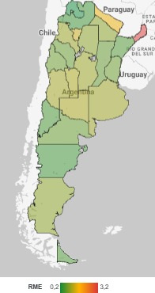

\thispagestyle{empty}

\begin{center}
  \vspace*{1cm}

  \Huge
  \textbf{TP 3: Estandarización de Tasas}

  \vspace{0.5cm}
  \LARGE

  \vspace{1.5cm}

  \textbf{Alumnos:}  Malena Irisarri, Román Landa\\

  \vfill

  \includegraphics[width=0.9\textwidth]{../tp2/img/logo_universidad.jpg}

  \vspace{0.8cm}


  Rosario, Argentina

  29 de Mayo de 2025
\end{center}

\newpage

# Introducción

## Estandarización de tasas

La estandarización de tasas es una herramienta fundamental en epidemiología y demografía que permite comparar indicadores de salud entre poblaciones con estructuras demográficas diferentes. Este método ajusta las tasas crudas (por ejemplo, de mortalidad o morbilidad) para eliminar el efecto de, por ejemplo, la edad o el sexo, lo que facilita la identificación de patrones y desigualdades reales entre grupos o regiones.

En este trabajo, se aplicará la estandarización de tasas para analizar las muertes por **infarto agudo de miocardio** durante el **año 2023** en las provincias de Argentina, utilizando como referencia la población estándar del país. A través de este proceso, se calcularán tasas estandarizadas por edad y las razones de mortalidad estándar (RME), lo que permitirá comparar el riesgo de muerte entre provincias de manera precisa.

## Infarto agudo de miocardio

El infarto agudo de miocardio, comúnmente conocido como ataque al corazón, es una emergencia médica que ocurre cuando el flujo sanguíneo al corazón se bloquea, lo que priva al corazón de oxígeno y puede causar la muerte de las células cardíacas.
Los síntomas incluyen rigidez o dolor en el pecho, el cuello, la espalda o los brazos, así como fatiga, mareos, ritmo cardíaco anormal y ansiedad.

Aunque cualquier persona puede sufrir un Infarto de Miocardio, no todas tienen el mismo riesgo. Las personas con problemas de corazón o que ya han sufrido un evento cardiovascular, las de edad avanzada y las que presentan factores de riesgo (hipertensión arterial, tabaquismo, obesidad, diabetes, elevación del colesterol malo (LDL), descenso del colesterol bueno (HDL)) tienen mayor riesgo. Los infartos no son hereditarios, pero personas con algún familiar de primer grado (padre, madre o hermano) que ya hayan padecido un infarto, o con una enfermedad hereditaria como hipercolesterolemia o diabetes tiene más posibilidades de padecerlo.

Dado que la edad es uno de los principales factores de riesgo, es fundamental tenerla en cuenta al comparar tasas de mortalidad por infarto entre distintas provincias. Por eso, en este análisis se realizará una estandarización por edad, lo cual permitirá una comparación más adecuada entre poblaciones con estructuras etarias diferentes.

## Datos

Para poder estandarizar las tasas de mortalidad, se requiere contar con el número de defunciones por infarto agudo de miocardio desagregado por provincia y grupo de edad. Esta información correspondiente al año 2023 fue obtenida de la página de la  [Dirección de Estadísticas e Información en Salud (DEIS)](https://www.argentina.gob.ar/salud/deis).

Además, se necesitaba la población dividida por grupos de edad para cada provincia, así como para el total del país (utilizado como población estándar). Estos datos fueron descargados del sitio del Instituto Nacional de Estadística y Censos (INDEC), en la sección de  [Proyecciones y Estimaciones de Población](https://www.indec.gob.ar/indec/web/Nivel3-Tema-2-24).


```{r include=FALSE}
# Función de limpieza común para los grupos de edad
clean_age_group <- function(age_string) {
  age_string <- str_replace(age_string, "^\\d{2}_", "") # Eliminar el prefijo "XX_"
  age_string <- str_trim(age_string) # Eliminar espacios
  age_string <- str_replace_all(age_string, "\\s+", " ")# Reemplazar múltiples espacios internos con un solo espacio
  # Usar un "negative lookahead" para asegurar que "a" no esté seguido de "y" (para preservar "y más")
  age_string <- str_replace(age_string, " a (?![y])", "-")
  age_string <- str_replace(age_string, "ymás", " y más")# Corregir casos como "80ymás" o "100ymás" para que tengan el espacio correcto
  return(age_string)
}

####### CARGAR LIBRERÍAS Y DATOS ###########
library(readxl)
library(readr)
library(stringr)
library(dplyr)
library(tidyr)
library(ggplot2)
library(kableExtra)
```

```{r include=FALSE}
######################## Tratamiento de defunciones ############################
defunciones <- read_delim("defweb23.csv",
                          delim = ";", escape_double = FALSE, trim_ws = TRUE)
causa <- 'I21' # Causa de defunción: Infarto agudo del miocardio

# Aplicar la función de limpieza a GRUPEDAD en 'defunciones' antes de agrupar
defunciones <- defunciones %>%
  mutate(GRUPEDAD = clean_age_group(GRUPEDAD))

# Filtrar por causa, agrupar por provincia y grupo de edad, y sumar 'CUENTA'
defunciones <- defunciones %>%
  filter(CAUSA == causa) %>%
  group_by(PROVRES, GRUPEDAD) %>%
  summarise(
    cuenta_total = sum(CUENTA, na.rm = TRUE)
  ) %>%
  ungroup()

# Cargar el archivo de códigos de provincia
cod_provincias <- read_excel("descdef1.xlsx",
                             sheet = "PROVRES")

# Realizar la unión (merge) de 'defunciones' con los nombres de provincia
defunciones <- defunciones %>%
  left_join(cod_provincias %>% select(CODIGO, VALOR), by = c("PROVRES" = "CODIGO"))

################################################################################


# Cargar y limpiar el dataframe 'edades'
edades <- read_excel("c2_proyecciones_prov_2010_2040.xls",
                     sheet = "01-TOTAL DEL PAÍS", range = "A59:A84")
edades <- edades[!apply(is.na(edades), 1, all), ]

# Aplicar la función de limpieza a la columna 'Edad' en 'edades'
edades <- edades %>%
  mutate(Edad = clean_age_group(Edad))


# Define la ruta de tu archivo principal (proyecciones provinciales)
ruta_archivo <- "c2_proyecciones_prov_2010_2040.xls"

# Obtener nombres de las hojas del archivo Excel y filtrar "GraphData"
nombres_hojas <- excel_sheets(ruta_archivo)
nombres_hojas <- nombres_hojas[nombres_hojas != "GraphData"]
```

# Metodo de Estandarización Directa

Para calcular las tasas de mortalidad estandarizadas utilizaremos el método directo de estandarización. Este consiste en en calcular las tasas brutas por grupos de edad para cada provincia y multiplicarla por la población estándar, en este caso la de Argentina.

```{r message=FALSE, warning=FALSE}
# Inicializar un vector para almacenar los nombres de los data frames generados
nombres_dfs_generados <- c()

# Bucle para procesar cada hoja del archivo de proyecciones
for (hoja in nombres_hojas) {
  # print(hoja) # Descomentar para depuración
  
  # 1. Leer los datos de la hoja actual
  datos_hoja <- read_excel(ruta_archivo,
                           sheet = hoja,
                           range = "F60:H84")
  
  # Eliminar filas donde TODAS las columnas son NA
  datos_hoja <- datos_hoja[!apply(is.na(datos_hoja), 1, all), ]
  
  # Verificar y unir 'edades' al data frame actual
  if (nrow(edades) != nrow(datos_hoja)) {
    warning(paste("El número de filas en 'edades' (", nrow(edades), ") no coincide con 'datos_hoja' (", nrow(datos_hoja), ") para la hoja:", hoja, ". Saltando esta hoja."))
    next # Saltar a la siguiente iteración del bucle
  }
  datos_hoja <- cbind(Edad = edades$Edad, datos_hoja) # Asegurar que la columna se llame 'Edad'
  
  # Extraer los dos primeros dígitos del nombre de la hoja para 'codigo_prov'
  codigo_provincia <- str_extract(hoja, "^\\d{2}")
  
  # Agregar la columna 'codigo_prov' al data.frame (como carácter)
  datos_hoja$codigo_prov <- codigo_provincia
  
  # Limpiar el nombre de la hoja para usarlo como nombre de variable en R
  nombre_limpio <- tolower(hoja)
  nombre_limpio <- str_replace_all(nombre_limpio, "^\\d{2}-", "") # Eliminar prefijo numérico
  nombre_limpio <- str_replace_all(nombre_limpio, "ñ", "n") # Reemplazar 'ñ'
  nombre_limpio <- str_replace_all(nombre_limpio, "[áéíóúü]", function(x) { # Quitar tildes
    chartr("áéíóúü", "aeiouu", x)
  })
  nombre_limpio <- str_replace_all(nombre_limpio, "[[:space:]]", "_") # Reemplazar espacios por guiones bajos
  nombre_limpio <- str_replace_all(nombre_limpio, "[^a-z0-9_]", "") # Eliminar caracteres no alfanuméricos
  
  # Eliminar la primera fila (asumiendo que es una fila de totales)
  datos_hoja <- datos_hoja[-1, ]
  
  # Convertir columnas numéricas a tipo numérico para cálculos
  cols_numericas <- c("Ambos sexos", "Varones", "Mujeres")
  for (col in cols_numericas) {
    if (col %in% colnames(datos_hoja)) {
      datos_hoja[[col]] <- as.numeric(datos_hoja[[col]])
    }
  }
  
  # Calcular la columna '%poblacion'
  datos_hoja$`%poblacion` <- (
    datos_hoja$`Ambos sexos` / sum(datos_hoja$`Ambos sexos`, na.rm = TRUE)
  ) * 100
  
  # Lógica para colapsar grupos de edad "80 y más"
  grupos_a_colapsar <- c("80-84", "85-89", "90-94", "95-99", "100 y más")
  nombre_columna_grupo_edad <- "Edad"
  
  filas_a_colapsar <- datos_hoja %>%
    filter(get(nombre_columna_grupo_edad) %in% grupos_a_colapsar)
  
  filas_no_colapsadas <- datos_hoja %>%
    filter(!get(nombre_columna_grupo_edad) %in% grupos_a_colapsar)
  
  if (nrow(filas_a_colapsar) > 0) {
    fila_colapsada <- filas_a_colapsar %>%
      summarise(
        !!nombre_columna_grupo_edad := "80 y más",
        `Ambos sexos` = sum(`Ambos sexos`, na.rm = TRUE),
        `Varones` = sum(`Varones`, na.rm = TRUE),
        `Mujeres` = sum(`Mujeres`, na.rm = TRUE),
        `%poblacion` = sum(`%poblacion`, na.rm = TRUE),
        codigo_prov = first(codigo_prov) # Tomar el código de provincia
      )
    datos_hoja <- bind_rows(filas_no_colapsadas, fila_colapsada)
  }
  
  # Realizar el merge con 'defunciones'
  datos_hoja <- datos_hoja %>%
    left_join(defunciones,
              by = c("codigo_prov" = "PROVRES", "Edad" = "GRUPEDAD"))
  
  # Asignar el data frame procesado al entorno global con el nombre limpio
  assign(nombre_limpio, datos_hoja, envir = .GlobalEnv)
  
  # Mensaje de confirmación y almacenamiento del nombre
  # cat("Creado data frame:", nombre_limpio, "\n")
  nombres_dfs_generados <- c(nombres_dfs_generados, nombre_limpio)
}

######################### Metodo Directo Estandarizacion ###########################

tasas_totales <- list()
tasa_estandar_directo <- list()
for (nombre_df_provincia in nombres_dfs_generados) {
  provincia_df <- get(nombre_df_provincia, envir = .GlobalEnv)
  
  # Calcula la 'tasa_por_edad'
  provincia_df <- provincia_df %>%
    mutate(
      tasa_por_edad = ifelse(
        !is.na(`Ambos sexos`) & `Ambos sexos` != 0,
        cuenta_total / `Ambos sexos`,
        0 # O NA
      )
    )
  provincia_df$defunciones_estandar <- provincia_df$tasa_por_edad*total_del_pais$`Ambos sexos`
  
  # Calcula la 'tasa_total' ponderada por fila
  tasa_total_ponderada <- sum(
    (provincia_df$tasa_por_edad * (provincia_df$`%poblacion` / 100)), # %poblacion / 100 
    na.rm = TRUE # Importante para que la suma ignore los NA
  )
  tasa_estandar <- sum((provincia_df$defunciones_estandar), na.rm = TRUE )/ sum(total_del_pais$`Ambos sexos`)
  
  # Almacena la tasa total ponderada en la lista 'tasas_totales'
  tasas_totales[[nombre_df_provincia]] <- tasa_total_ponderada
  tasa_estandar_directo[[nombre_df_provincia]] <- tasa_estandar
  
  
  # Asigna el data frame actualizado con 'tasa_por_edad' de nuevo al entorno global
  assign(nombre_df_provincia, provincia_df, envir = .GlobalEnv)
}
```

# Metodo de Estandarización Indirecto

Utilizamos el método indirecto para calcular la relación entre el número observado y esperado de casos, es decir las razones de mortalidad estandarizadas (RME).

```{r message=FALSE, warning=FALSE}

# Recalcular defunciones_totales
defunciones_totales <- defunciones %>%
  group_by(GRUPEDAD) %>%
  summarise(
    cuenta_total = sum(cuenta_total, na.rm = TRUE)
  ) %>%
  ungroup() 

defunciones_totales <- defunciones_totales %>%
  left_join(
    total_del_pais %>% select(Edad, `Ambos sexos`),
    by = c("GRUPEDAD" = "Edad")
  ) %>%
  mutate(
    tasa = ifelse(
      !is.na(`Ambos sexos`) & `Ambos sexos` != 0,
      cuenta_total / `Ambos sexos`,
      0 # Si 'Ambos sexos' es NA o 0, la tasa es 0.
    )
  )
rme_indirecta <- list()

for (nombre_df_provincia in nombres_dfs_generados) {
  provincia_df <- get(nombre_df_provincia, envir = .GlobalEnv)

  # --- PASO 1: Joinear la columna 'tasa_nacional'
  provincia_df <- provincia_df %>%
    left_join(
      # Seleccionamos GRUPEDAD, y renombramos 'tasa' a 'tasa_nacional'
      defunciones_totales %>% select(GRUPEDAD, tasa_nacional = tasa), 
      by = c("Edad" = "GRUPEDAD") # unimos por las columnas de grupo de edad
    ) %>%
    mutate(tasa_nacional = replace_na(tasa_nacional, 0)) 
  # --- PASO 2: Calcular 'defunciones_indirectas' usando la nueva columna 'tasa_nacional' ---
  provincia_df <- provincia_df %>%
    mutate(
      # Ahora usamos 'tasa_nacional' para el cálculo
      defunciones_indirectas = `Ambos sexos` * tasa_nacional 
    )
  # --- PASO 3: Calculo de RME ---
  total_esperado <- sum(provincia_df$defunciones_indirectas, na.rm = TRUE)
  total_observado <- sum(provincia_df$cuenta_total, na.rm = TRUE)
  if (total_esperado != 0) {
    rme_indirecta[[nombre_df_provincia]] <- total_observado / total_esperado
  } else {
    rme_indirecta[[nombre_df_provincia]] <- NaN
    warning(paste("Total esperado es cero para", nombre_df_provincia, ". RME será NaN/Inf."))
  }

  assign(nombre_df_provincia, provincia_df, envir = .GlobalEnv)
}

# print("Razones de Mortalidad Estandarizadas Indirectas (RME):")
# print(rme_indirecta)
```

\newpage

# Resultados

Nos parece importante comparar las tasas crudas y las estandarizadas ya que nos indican si la edad de cada provincia está distribuída parecida a la población Argentina. Por ejemplo:

```{r include=FALSE}
library(tools)

df_resultados <- tibble(
  provincia = nombres_dfs_generados, # Nombre de la provincia (ej. "buenos_aires")
  rme = as.numeric(rme_indirecta[nombres_dfs_generados]), # Razón de Mortalidad Estandarizada Indirecta
  tasas_provinciales = as.numeric(tasas_totales[nombres_dfs_generados]), # Tasa provincial cruda/ponderada
  tasas_estandar_directas = as.numeric(tasa_estandar_directo[nombres_dfs_generados]) # Tasa Estandarizada Directa
)
df_resultados <- df_resultados[-1,]

df_resultados <- df_resultados %>%
  mutate(
    # 1. Reemplazar guiones bajos por espacios
    provincia = gsub("_", " ", provincia),
    # 2. Capitalizar la primera letra de cada palabra
    provincia = tools::toTitleCase(provincia),
    # 3. Manejar casos especiales si es necesario (ej. "Del" en "Santiago Del Estero")
    provincia = ifelse(provincia == "Santiago Del Estero", "Santiago del Estero", provincia),
    # 4. Ajustar "Caba" a "C.A.B.A."
    provincia = ifelse(provincia == "Caba", "C.A.B.A.", provincia) 
  ) %>%
  arrange(provincia)

```

```{r echo=FALSE}
# --- 1. Pivotar el dataframe de resultados a formato largo ---
df_tasas_long <- df_resultados %>%
  select(provincia, tasas_provinciales, tasas_estandar_directas) %>% # Seleccionamos solo las columnas de interés
  pivot_longer(
    cols = c(tasas_provinciales, tasas_estandar_directas), # Las columnas que queremos pivotar
    names_to = "tipo_tasa", # Nuevo nombre para la columna que contendrá los nombres originales
    values_to = "valor_tasa" # Nuevo nombre para la columna que contendrá los valores
  ) %>%
  mutate(
    tipo_tasa = case_when(
      tipo_tasa == "tasas_provinciales" ~ "Tasa Provincial Cruda",
      tipo_tasa == "tasas_estandar_directas" ~ "Tasa Estandarizada Directa",
      TRUE ~ tipo_tasa 
    )
  )
tasa_nacional_valor <- sum(total_del_pais$tasa_nacional * (total_del_pais$`%poblacion` / 100))

tabla_para_mostrar <- df_resultados %>% # Usamos el df_resultados ya transformado
  select(
    Provincia = provincia,
    `Tasa Cruda` = tasas_provinciales,
    `Tasa Estandarizada` = tasas_estandar_directas
  ) %>%
  # Formatear las tasas para que se vean bien en la tabla (por 1.000 y 2 decimales)
  mutate(
    `Tasa Cruda` = scales::number(`Tasa Cruda` * 1000, accuracy = 0.01),
    `Tasa Estandarizada` = scales::number(`Tasa Estandarizada` * 1000, accuracy = 0.01)
  )

# Mostrar la tabla usando kable
kable(tabla_para_mostrar, 
      caption = " Tasas de Mortalidad por Provincia (por 1.000 habitantes)",
      align = c("l", "c", "c")) %>%
  kable_styling(
    bootstrap_options = c("striped", "hover", "condensed", "responsive"), # Opciones de estilo Bootstrap
    full_width = FALSE, # La tabla no ocupa todo el ancho de la página
    position = "center") %>%  # Alinea la tabla a la izquierda
    row_spec(row = 0, background = "#4682B4", color = "black", extra_css = "font-weight: bold;")
```

 * Si la **Tasa Cruda > Tasa Estandarizada**, la provincia tiende a tener una población más envejecida que la población de referencia. Su tasa cruda parece alta, pero al ajustar por edad, su mortalidad es en realidad más baja de lo que la tasa cruda sugiere.
 
 * Si la **Tasa Cruda < Tasa Estandarizada**, la provincia tiende a tener una población más joven que la población de referencia. Su tasa cruda parece baja, pero al ajustar por edad, su mortalidad es en realidad más alta de lo que la tasa cruda sugiere. 

```{r echo=FALSE}
# --- 2. Crear el gráfico con las dos barras por provincia ---
ggplot(df_tasas_long) +
  aes(x = provincia, y = valor_tasa, fill = tipo_tasa) +
  geom_col(position = "dodge") +
  labs(
    title = "Comparación de Tasas de Mortalidad por Provincia",
    subtitle = "Tasa Provincial Cruda vs. Tasa Estandarizada Directa",
    x = "Provincia",
    y = "Valor de la Tasa (por 1.000 habitantes)", # Texto del eje Y actualizado
    fill = "Tipo de Tasa",
    # --- Añadir el caption para explicar la línea punteada ---
    caption = paste0("La línea punteada roja representa la Tasa de Mortalidad Nacional de Argentina:",
                     "\n", # Salto de línea
                     round(tasa_nacional_valor * 1000, 2), " por 1.000 habitantes.")
  ) +
  geom_hline(yintercept = tasa_nacional_valor, linetype = "dashed", color = "red", linewidth = 0.8) +
  theme_minimal() +
  theme(axis.text.x = element_text(angle = 45, hjust = 1),
        plot.caption = element_text(hjust = 0),
        plot.margin = margin(t = 10, r = 10, b = 20, l = 10, unit = "pt")) +
  scale_fill_brewer(palette = "Paired") +
  # --- Formatear el eje Y para mostrar números más legibles ---
  scale_y_continuous(labels = scales::number_format(scale = 1000, accuracy = 0.01))
```


 
Particularmente llama la atención en el gráfico 1 es Misiones, ya que tiene una tasa estandarizada muy por arriba de su tasa cruda, ambas muy elevadas en comparación con otras provincias y la tasa de mortalidad de Argentina. Esto es una señal de alerta ya dicha provincia tiene una estructura de edad más joven que la población de referencia (o bien, presenta una alta proporción de población en edades de baja mortalidad), pero aún así presenta una mortalidad muy elevada. Esto sugiere que el riesgo de muerte allí es alto y no se debe al envejecimiento de la población. 

## Provincias con Tasas Estandarizadas por encima de la Nacional

Además de Misiones, CABA, Formosa, La Pampa, Mendoza, San Luis y Tucumán muestran sus tasas estandarizadas por encima de la línea nacional.
Esto significa que, si estas provincias tuvieran la misma estructura de edad que el país en su conjunto, su mortalidad sería más alta que el promedio. Esto nos indica de que existen factores de riesgo de mortalidad inherentes a la población de estas provincias que no se explican por la edad, y que necesitan atención en salud pública.

## Provincias con Tasas Estandarizadas por debajo de la Nacional

Chaco, Chubut, Corrientes, Entre Ríos, Jujuy, La Rioja, Neuquén, Rio Negro, Salta, San Juan, Santa Cruz, Santa Fe, Santiago del Estero y Tierra del Fuego tienen tasas estandarizadas por debajo de la línea nacional. Esto indica que, controlando el efecto de la estructura de edad de su población, el riesgo de morir en estas provincias es menor que el promedio del país. Es una señal de una situación de mortalidad relativamente más favorable.


En el mapa también vemos que la provincia con mayor tasa es Misiones, ya que aparece en color rojo.

## Razones de Mortalidad Estandarizadas 

Una vez calculadas las razones de mortalidad estandarizadas para cada provincia por el método indirecto (RME), podemos interpretarlas comparándolas con el valor de 1, que actúa como nuestro punto de referencia nacional.

```{r echo=FALSE}
tabla_para_mostrar2 <- df_resultados %>% # Usamos el df_resultados ya transformado
  select(
    Provincia = provincia,
    RME = rme
  ) 
# Mostrar la tabla usando kable
kable(tabla_para_mostrar2, 
      caption = " Razones de Mortalidad Estandarizadas por Provincia",
      align = c("l", "c")) %>%
  kable_styling(
    bootstrap_options = c("striped", "hover", "condensed", "responsive"), # Opciones de estilo Bootstrap
    full_width = FALSE, # La tabla no ocupa todo el ancho de la página
    position = "center") %>%  # Alinea la tabla a la izquierda
    row_spec(row = 0, background = "#4682B4", color = "black", extra_css = "font-weight: bold;") %>% 
  row_spec(row = c(2, 9, 11, 13, 14, 19, 24), background = "#ADD8E6", color = "black")

ggplot(df_resultados) + # Assuming your dataframe is named df_resultados_consolidados
  aes(x = provincia, y = rme) +
  geom_col(fill = "#4682B4") + # Use geom_col() for pre-summarized data
  labs(
    title = "Razón de Mortalidad Estandarizada (RME) por Provincia",
    x = "Provincia",
    y = "RME"
  ) +
  geom_hline(yintercept = 1, linetype = "dashed", color = "red", linewidth = 0.8) +
  theme_minimal() + # A cleaner theme
  theme(axis.text.x = element_text(angle = 45, hjust = 1))
```


Vemos que CABA, Formosa, La Pampa, Mendoza, Misiones, San Luis y Tucumán  tiene una RME mayor que 1, lo que indica que la mortalidad observada en esa provincia es superior a la que se esperaría si su población por edad hubiera experimentado las tasas de mortalidad nacionales. En otras palabras, mueren más personas de las que se prevería basándose en la estructura de edad de la provincia y las tasas de mortalidad del país.

Por el contrario, para el resto de las provincias, la mortalidad observada es inferior a la que se esperaría con las tasas de mortalidad nacionales aplicadas a su estructura de edad. Esto sugiere que mueren menos personas de las que se prevería.

Este análisis nos permite identificar facilmente qué provincias tienen una mortalidad "peor" o "mejor" de lo esperado, considerando únicamente el efecto de la distribución por edad de su población y comparándolas con un estándar nacional.





Por último, en la figura 2, observamos el mapa según RME, donde nuevamente se destacan Misiones y Jujuy como "peor" y "mejor" respectivamente.